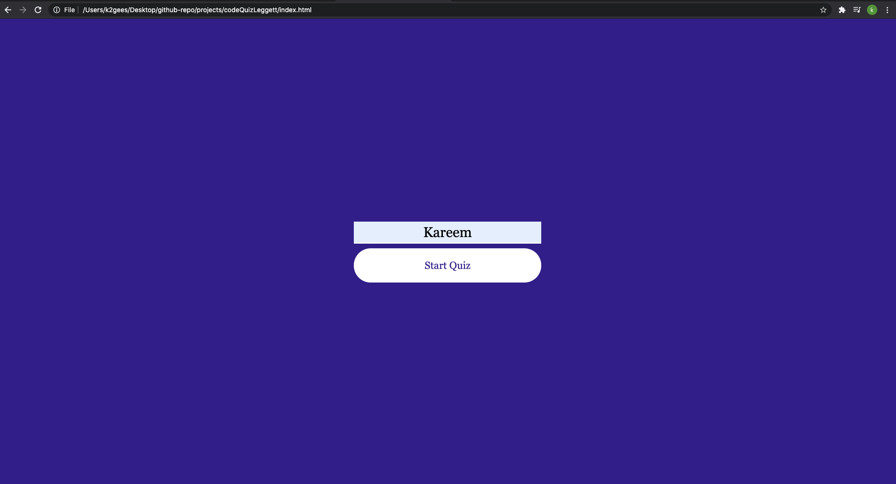
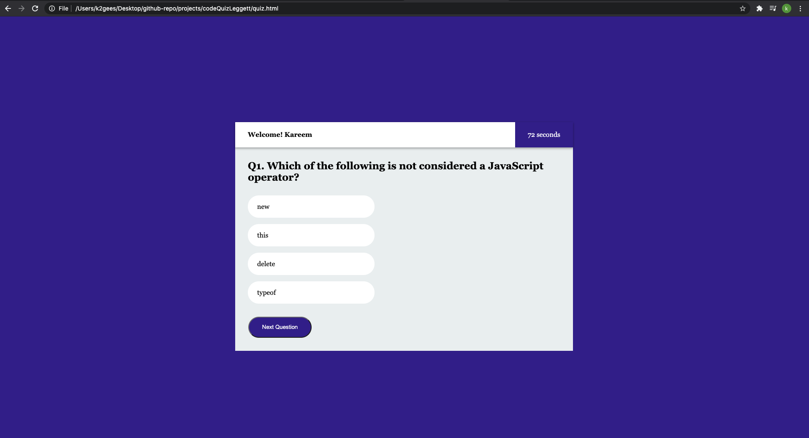
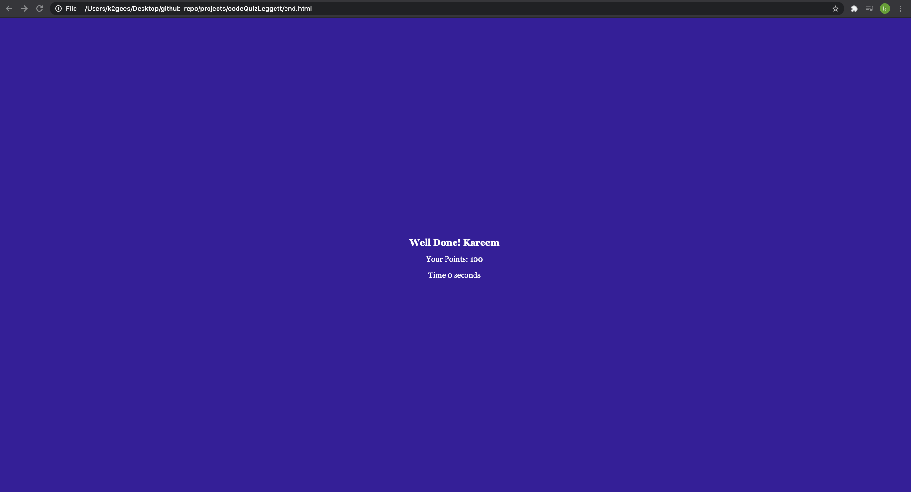

# codeQuizLeggett

## Purpose
Create a quiz with a timer.  This quiz will store and grade each answer.  If an answer is wrong, time will be subtracted from the timer.  After you are finished you will be given a score that allowed to initial said score that will be tracked on a high score leaderboard.

## Built with
HTML
CSS
Java

## Website
https://github.com/K2gees/codeQuizLeggett
//PUBLISHED SITE WILL GO HERE

## Screenshots

### Closing
Our user interface is reactive to the user and provides immediate feedback.  This is a responsive tool that should be very easy fro the end user to navigate.  

